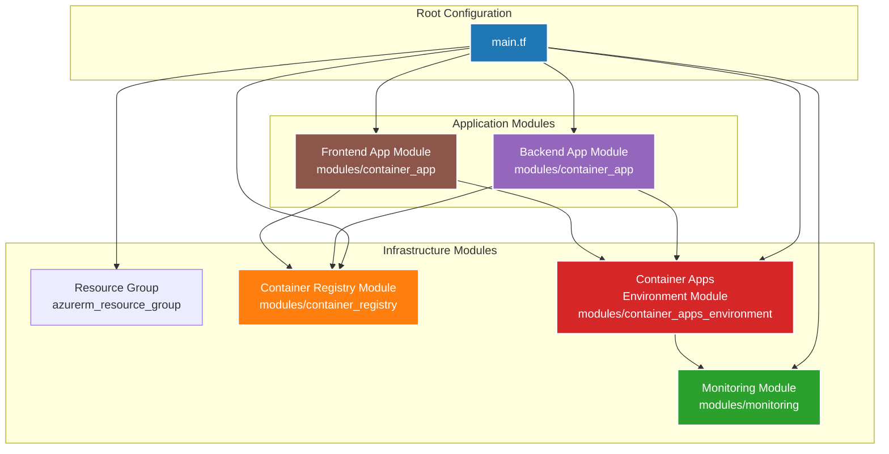
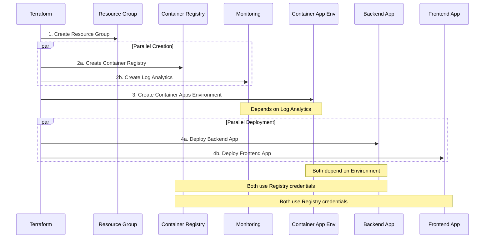

# Terraform Module Architecture

## Module Dependency Graph



## Module Structure

### 1. Container Registry Module
**Purpose**: Manages Azure Container Registry for storing Docker images

**Resources**:
- `azurecaf_name.acr` - Generates unique registry name
- `azurerm_container_registry.main` - ACR instance

**Outputs**: `id`, `name`, `login_server`, `admin_username`, `admin_password`

---

### 2. Monitoring Module
**Purpose**: Provides Log Analytics Workspace for monitoring and diagnostics

**Resources**:
- `azurecaf_name.log_analytics` - Generates unique workspace name
- `azurerm_log_analytics_workspace.main` - Log Analytics instance

**Outputs**: `id`, `name`, `workspace_id`, `primary_shared_key`

---

### 3. Container Apps Environment Module
**Purpose**: Creates the hosting environment for container applications

**Resources**:
- `azurecaf_name.container_env` - Generates unique environment name
- `azurerm_container_app_environment.main` - Environment instance

**Dependencies**: `monitoring` module (requires Log Analytics workspace ID)

**Outputs**: `id`, `name`, `default_domain`, `static_ip_address`

---

### 4. Container App Module (Reusable)
**Purpose**: Deploys individual container applications with configurable settings

**Resources**:
- `azurecaf_name.app` - Generates unique app name
- `azurerm_container_app.main` - Container app instance

**Dependencies**: 
- `container_apps_environment` module (requires environment ID)
- `container_registry` module (optional, for private images)

**Features**:
- Configurable CPU/memory
- Scalable replicas (1-30)
- Environment variables support
- Ingress configuration
- Health probes
- Registry authentication

**Outputs**: `id`, `name`, `latest_revision_name`, `latest_revision_fqdn`, `ingress_fqdn`

**Instances**:
- Backend App (Spring Boot, 0.5 CPU, 1GB RAM)
- Frontend App (React/Nginx, 0.25 CPU, 0.5GB RAM)

---

## Deployment Flow



## Resource Organization

```
Azure Resource Group
├── Container Registry
│   └── Stores: backend:latest, frontend:latest
│
├── Log Analytics Workspace
│   └── Collects logs from all container apps
│
├── Container Apps Environment
│   ├── Integrated with Log Analytics
│   ├── Provides default domain
│   └── Manages networking
│
└── Container Apps
    ├── Backend Container App
    │   ├── Image: backend:latest from ACR
    │   ├── Replicas: 1-3 (auto-scale)
    │   ├── CPU: 0.5, Memory: 1Gi
    │   └── Port: 8080
    │
    └── Frontend Container App
        ├── Image: frontend:latest from ACR
        ├── Replicas: 1-3 (auto-scale)
        ├── CPU: 0.25, Memory: 0.5Gi
        └── Port: 80
```

## Module Reusability Example

The `container_app` module is designed for reusability. Adding a new service is simple:

```hcl
# Add a new microservice using the same module
module "api_gateway" {
  source = "./modules/container_app"

  app_name                     = "${var.environment_name}-api-gateway"
  resource_group_name          = azurerm_resource_group.main.name
  container_app_environment_id = module.container_apps_environment.id

  container_name   = "api-gateway"
  container_image  = "${module.container_registry.login_server}/api-gateway:latest"
  container_cpu    = 0.5
  container_memory = "1Gi"

  environment_variables = [
    {
      name  = "BACKEND_URL"
      value = module.backend_app.ingress_fqdn
    }
  ]

  target_port      = 8080
  external_enabled = true

  registry_server   = module.container_registry.login_server
  registry_username = module.container_registry.admin_username
  registry_password = module.container_registry.admin_password

  tags = merge(local.tags, { "azd-service-name" = "api-gateway" })
}
```

## Benefits Summary

### Before Modularization
- **Single File**: All 243 lines in main.tf
- **Duplication**: Backend and frontend had similar but duplicated code
- **Hard to Scale**: Adding new services required copying and modifying large blocks
- **Difficult to Test**: Couldn't test individual components in isolation

### After Modularization
- **Organized**: 185 lines in main.tf + 4 focused modules
- **DRY Principle**: Single `container_app` module used for both backend and frontend
- **Easy to Scale**: New services = new module instantiation
- **Testable**: Each module can be validated independently
- **Maintainable**: Changes to one service don't affect others
- **Documented**: Each module has comprehensive README with examples

## Future Extensibility

The modular structure makes it easy to add new infrastructure:

### Networking Module
```hcl
module "networking" {
  source = "./modules/networking"
  # VNet, Subnets, NSGs, etc.
}
```

### Database Module
```hcl
module "database" {
  source = "./modules/database"
  # Azure Database for PostgreSQL
}
```

### Key Vault Module
```hcl
module "key_vault" {
  source = "./modules/key_vault"
  # Secrets management
}
```

### Storage Module
```hcl
module "storage" {
  source = "./modules/storage"
  # Blob storage for files
}
```

Each new module follows the same pattern:
1. Create module directory with `main.tf`, `variables.tf`, `outputs.tf`, `README.md`
2. Define resources and dependencies
3. Document inputs and outputs
4. Instantiate in root `main.tf`

## Terraform Commands Reference

```bash
# Initialize and download providers
terraform init

# Validate syntax and configuration
terraform validate

# Format code
terraform fmt -recursive

# Preview changes
terraform plan

# Apply changes
terraform apply

# Destroy resources
terraform destroy

# View outputs
terraform output
```
