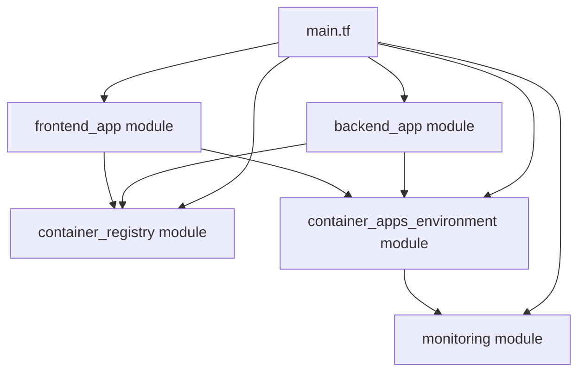

# Three Rivers Bank - Terraform Infrastructure

This directory contains the Terraform infrastructure as code for deploying the Three Rivers Bank credit card application to Azure.

## Architecture Overview

The infrastructure is organized into modular components for maintainability and reusability:

```
terraform/
├── main.tf                    # Root configuration using modules
├── variables.tf               # Input variables
├── outputs.tf                 # Output values
└── modules/
    ├── container_registry/    # Azure Container Registry
    ├── monitoring/            # Log Analytics Workspace
    ├── container_apps_environment/  # Container Apps Environment
    └── container_app/         # Reusable Container App module
```

## Deployed Resources

### Core Infrastructure
1. **Resource Group** - Container for all Azure resources
2. **Container Registry** - Stores Docker images for backend and frontend
3. **Log Analytics Workspace** - Collects logs and metrics
4. **Container Apps Environment** - Hosting environment for container apps

### Application Services
5. **Backend Container App** - Spring Boot API (Java 17, 0.5 vCPU, 1GB RAM)
6. **Frontend Container App** - React SPA (Vite, 0.25 vCPU, 0.5GB RAM)

## Module Architecture

The infrastructure follows a modular design pattern where each Azure service is encapsulated in a reusable module:



### Module Dependencies
- `container_apps_environment` depends on `monitoring` (Log Analytics)
- `backend_app` and `frontend_app` depend on `container_apps_environment`
- `backend_app` and `frontend_app` optionally use `container_registry` for authentication

## Prerequisites

- [Terraform](https://www.terraform.io/downloads.html) >= 1.0
- [Azure CLI](https://docs.microsoft.com/en-us/cli/azure/install-azure-cli)
- Azure subscription with sufficient permissions

## Setup

### 1. Authenticate with Azure

```bash
az login
az account set --subscription "<your-subscription-id>"
```

### 2. Initialize Terraform

```bash
cd infra/terraform
terraform init
```

### 3. Review and Customize Variables

Edit `variables.tf` or create a `terraform.tfvars` file:

```hcl
environment_name = "dev"
location         = "East US"
tags = {
  project     = "three-rivers-bank"
  environment = "development"
}
```

### 4. Plan Deployment

```bash
terraform plan -out=tfplan
```

Review the planned changes carefully.

### 5. Apply Configuration

```bash
terraform apply tfplan
```

### 6. View Outputs

```bash
terraform output
```

## Variables

| Name | Description | Type | Default | Required |
|------|-------------|------|---------|----------|
| environment_name | The name of the azd environment | string | - | yes |
| location | The Azure region | string | "East US" | no |
| principal_id | The service principal ID | string | "" | no |
| tags | Tags to apply to resources | map(string) | {} | no |
| backend_image_name | Backend container image | string | "backend:latest" | no |
| frontend_image_name | Frontend container image | string | "frontend:latest" | no |
| container_cpu | Container CPU allocation | number | 0.5 | no |
| container_memory | Container memory allocation | string | "1Gi" | no |

## Outputs

| Name | Description |
|------|-------------|
| azure_location | The deployed Azure region |
| azure_resource_group_name | The resource group name |
| azure_container_registry_endpoint | Container registry login server |
| backend_uri | Backend service URL |
| frontend_uri | Frontend service URL |
| azure_container_environment_name | Container Apps environment name |
| backend_service_name | Backend app name |
| frontend_service_name | Frontend app name |

## Module Documentation

Each module has comprehensive documentation:

- [Container Registry Module](./modules/container_registry/README.md)
- [Monitoring Module](./modules/monitoring/README.md)
- [Container Apps Environment Module](./modules/container_apps_environment/README.md)
- [Container App Module](./modules/container_app/README.md)
- [Modules Overview](./modules/README.md)

## Deployment Workflow

1. **Build Docker Images** (handled by CI/CD)
   ```bash
   docker build -t backend:latest ./backend
   docker build -t frontend:latest ./frontend
   ```

2. **Push to Container Registry**
   ```bash
   az acr login --name <registry-name>
   docker push <registry-name>.azurecr.io/backend:latest
   docker push <registry-name>.azurecr.io/frontend:latest
   ```

3. **Deploy Infrastructure**
   ```bash
   terraform apply
   ```

4. **Update Container Images** (in Container Apps)
   - Backend and Frontend apps will pull images from ACR
   - Environment variables are configured automatically

## Configuration Details

### Backend Container App
- **Image**: Backend Spring Boot application
- **CPU**: 0.5 cores
- **Memory**: 1GB
- **Port**: 8080
- **Replicas**: 1-3 (auto-scaling)
- **Environment Variables**:
  - `CORS_ALLOWED_ORIGINS` - Frontend URL for CORS
  - `BIAN_API_URL` - BIAN API endpoint
  - `H2_CONSOLE_ENABLED` - H2 console (disabled in production)
  - `LOGGING_LEVEL` - Log verbosity
  - `SPRING_PROFILES_ACTIVE` - Spring profile

### Frontend Container App
- **Image**: Frontend React/Vite application
- **CPU**: 0.25 cores
- **Memory**: 0.5GB
- **Port**: 80
- **Replicas**: 1-3 (auto-scaling)
- **Environment Variables**:
  - `VITE_API_BASE_URL` - Backend API URL

## Maintenance

### Updating Infrastructure

1. Modify the relevant module or root configuration
2. Run `terraform plan` to review changes
3. Run `terraform apply` to apply changes

### Adding New Services

To add a new container app:

```hcl
module "new_service" {
  source = "./modules/container_app"

  app_name                     = "${var.environment_name}-new-service"
  resource_group_name          = azurerm_resource_group.main.name
  container_app_environment_id = module.container_apps_environment.id

  container_name   = "new-service"
  container_image  = "${module.container_registry.login_server}/new-service:latest"
  container_cpu    = 0.5
  container_memory = "1Gi"

  environment_variables = [
    # Your environment variables
  ]

  target_port = 8080

  registry_server   = module.container_registry.login_server
  registry_username = module.container_registry.admin_username
  registry_password = module.container_registry.admin_password

  tags = merge(local.tags, { "azd-service-name" = "new-service" })
}
```

### Destroying Infrastructure

⚠️ **Warning**: This will delete all resources and data.

```bash
terraform destroy
```

## Troubleshooting

### Common Issues

**Issue**: Module not found
```
Error: Module not installed
```
**Solution**: Run `terraform init` to download modules

**Issue**: Authentication errors
```
Error: building account: ...
```
**Solution**: Run `az login` and ensure you have the correct subscription selected

**Issue**: Resource name conflicts
```
Error: A resource with the ID already exists
```
**Solution**: Change the `environment_name` variable or manually delete conflicting resources

### Terraform State

The Terraform state file (`terraform.tfstate`) tracks your infrastructure. 

**Best Practices**:
- Use remote state storage (Azure Storage, Terraform Cloud)
- Enable state locking
- Never edit state files manually
- Commit `.gitignore` to exclude state files from version control

## Integration with Azure Developer CLI (azd)

This infrastructure is compatible with `azd`:

```bash
# Initialize azd
azd init

# Provision infrastructure
azd provision

# Deploy application
azd deploy

# Clean up
azd down
```

## Security Considerations

- Container Registry admin password is stored in Terraform state (sensitive)
- Use Azure Key Vault for production secrets
- Enable Azure AD authentication for Container Registry
- Implement network security groups for production
- Use managed identities instead of admin passwords

## Cost Estimation

Approximate monthly costs (East US region):

| Resource | Tier | Estimated Cost |
|----------|------|----------------|
| Container Apps (2) | Consumption | $30-50 |
| Container Registry | Basic | $5 |
| Log Analytics | Pay-as-you-go | $5-10 |
| **Total** | | **$40-65/month** |

*Costs vary based on usage and region*

## Additional Resources

- [Azure Container Apps Documentation](https://docs.microsoft.com/en-us/azure/container-apps/)
- [Terraform Azure Provider](https://registry.terraform.io/providers/hashicorp/azurerm/latest/docs)
- [Azure CAF Naming Conventions](https://docs.microsoft.com/en-us/azure/cloud-adoption-framework/ready/azure-best-practices/naming-and-tagging)
- [Project Documentation](../../README.md)
